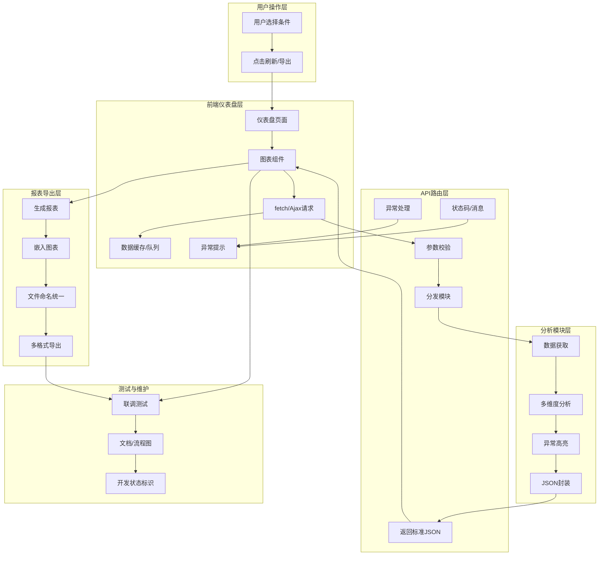

analysis_module/output/         # 存放所有导出文件
analysis_module/export_utils.py # 导出工具，支持Excel/CSV/PDF，供分析模块和页面逻辑调用
page_logic/order_page.py        # 页面逻辑调用分析模块，展示数据并导出文件，实现数据闭环
# analysis_module/ （数据分析模块）

功能：对订单、库存、广告、结算等数据进行分析和汇总，所有分析接口输入输出统一，便于页面逻辑调用
结构：
├── __init__.py
├── order_analysis.py         # 订单数据分析，analyze_orders(start_date, end_date, filters=None) -> List[Dict]
├── inventory_analysis.py     # 库存数据分析，analyze_inventory(filters=None) -> List[Dict]
├── ads_analysis.py           # 广告数据分析，analyze_ads(filters=None) -> List[Dict]
├── settlement_analysis.py    # 结算/利润数据分析，analyze_settlement(filters=None) -> List[Dict]
├── summary_analysis.py       # 综合汇总分析，analyze_summary(params=None) -> Dict

说明：每个分析文件独立，接口模板统一，便于扩展和维护，统一调用 data_module 公共接口，输出统一数据结构
# inventory/ （库存模块）

功能：获取库存数据、解析、标准化、缓存、日志
接口：get_inventory(filters=None) -> List[Inventory]
说明：返回统一库存对象列表，支持缓存和异常处理

# ads/ （广告模块）

功能：获取广告数据、解析、标准化、缓存、日志
接口：get_ads(filters=None) -> List[Ad]
说明：返回统一广告对象列表，支持缓存和异常处理

# settlement/ （结算/利润模块）

功能：获取结算数据、计算利润、缓存、日志
接口：get_settlement(filters=None) -> List[Settlement]
说明：返回统一结算对象列表，支持缓存和异常处理
# inventory/ （库存模块）

功能：获取库存数据、解析、标准化、缓存、日志

输出：inventory_module.py 提供统一的 get_inventory() 接口

# ads/ （广告模块）

功能：获取广告数据、解析、标准化、缓存、日志

输出：ads_module.py 提供统一的 get_ads() 接口

# settlement/ （结算/利润模块）

功能：获取结算数据、计算利润、缓存、日志

输出：settlement_module.py 提供统一的 get_settlement() 接口
# orders/ （订单模块）

功能：获取订单数据、解析、标准化、缓存、日志

输出：orders_module.py 提供统一的 get_orders() 接口

# 开发规范（步骤0）

1. 每个模块核心逻辑锁定后不可修改
2. 所有代码需中文注释，文件头规范（文件名、日期、版本、作者）
3. 所有接口统一返回对象或字典列表
4. 每次修改或完成模块后，自动更新 Architecture.md 和 ModuleDescription.md
5. 开发前需先确认字段、接口和缓存策略

# 项目构架说明


## 中文详细构架图说明

```
amz_erp/
│
├── data_module/                 # 公共数据模块
│   ├── orders/                  # 订单数据模块
│   │   ├── __init__.py
│   │   ├── orders_module.py     # 订单数据处理核心文件
│   │   └── README.md            # 中文说明
│   ├── inventory/               # 库存数据模块
│   │   ├── __init__.py
│   │   ├── inventory_module.py  # 库存数据处理核心文件
│   │   └── README.md            # 中文说明
│   ├── ads/                     # 广告数据模块
│   │   ├── __init__.py
│   │   ├── ads_module.py        # 广告数据处理核心文件
│   │   └── README.md            # 中文说明
│   ├── settlement/              # 结算/利润模块
│   │   ├── __init__.py
│   │   ├── settlement_module.py # 结算/利润数据处理核心文件
│   │   └── README.md            # 中文说明
│   └── utils/                   # 工具模块
│       ├── __init__.py
│       ├── utils.py             # 日志/缓存/异常处理
│       └── README.md            # 中文说明
│
├── analysis_module/             # 数据分析模块
│   ├── __init__.py
│   ├── order_analysis.py        # 订单分析
│   ├── inventory_analysis.py    # 库存分析
│   ├── ads_analysis.py          # 广告分析
│   ├── settlement_analysis.py   # 结算/利润分析
│   └── summary_analysis.py      # 综合汇总分析
│
├── page_logic/                  # 页面后端逻辑
│   ├── __init__.py
│   └── xxx_page.py              # 页面后端逻辑文件
│
├── frontend/                    # 前端展示层
│   ├── index.html
│   ├── orders.js
│   ├── inventory.js
│   └── style.css
│
├── tests/                       # 单元测试
│   ├── test_orders.py
│   ├── test_inventory.py
│   ├── test_ads.py
│   ├── test_settlement.py
│   └── test_utils.py
│
└── main.py                      # 程序启动入口
```

### 依赖关系与数据流向
- 各数据模块通过 utils 工具进行缓存、日志、异常处理
- analysis_module 只调用 data_module，不直接操作 API
- page_logic 只处理页面业务，调用 analysis_module
- frontend 通过接口与后端交互，展示数据
- tests 负责各模块的单元测试

---

# ERP数据分析系统架构优化版

## 一、整体结构分层
- 用户操作层
- 前端仪表盘层（ECharts/交互/主题/组件化）
- API路由层（参数校验/分发/异常处理）
- 分析模块层（数据处理/多维度分析/异常高亮）
- 报表导出层（多格式/嵌入图表/统一命名）
- 测试与维护层（联调/文档/开发状态）

---

## 二、可视化流程图（Mermaid）

```

---

## 三、关键节点与异常处理
- 关键操作高亮：fetch/Ajax请求、返回JSON、ECharts渲染、报表导出
- 异常处理节点：后端分析异常、前端渲染异常、接口状态码
- 测试与维护环节贯穿全链路

---

## 四、开发状态标识
- 已完成：主流程、基础功能、报表导出
- 开发中：高级交互、批量导出、主题美化
- 待测试：多维度联动、异常处理、性能优化
