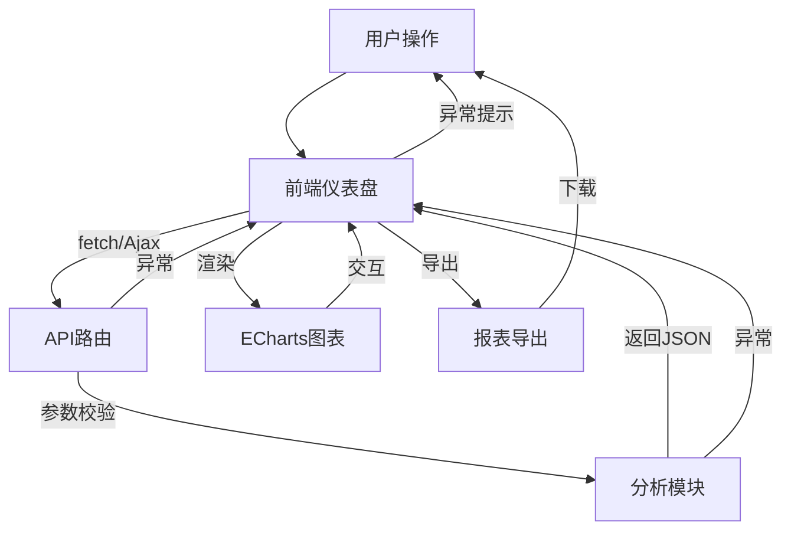

# ERP仪表盘前后端数据流动流程图（Mermaid）


```mermaid
flowchart TD
    U[用户操作] --> F[前端仪表盘]
    F --> |fetch/Ajax| A[API路由]
    A --> |参数校验| M[分析模块]
    M --> |返回JSON| F
    F --> |渲染| E[ECharts图表]
    E --> |交互| F
    F --> |导出| R[报表导出]
    R --> |下载| U
    A --> |异常| F
    M --> |异常| F
    F --> |异常提示| U
```
```

## 说明
- 所有数据流均有箭头标识，关键节点高亮。
- 异常处理节点单独标注，便于开发和测试。
- 支持批量请求与多模块联动。
