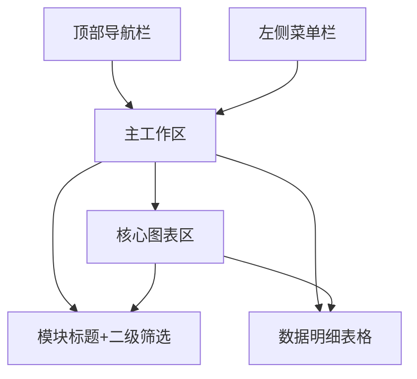

# ERP数据分析仪表盘 Wireframe 结构说明

## 一、整体布局（三段式）

```
+---------------------------------------------------------------+
| 顶部导航栏                                                  |
| Logo | 项目名 | 时间筛选 | 全局搜索 | 用户入口 | 导出按钮      |
+-------------------+-------------------------------------------+
| 左侧菜单栏        | 主工作区                                  |
| 模块导航          | 1. 顶部：模块标题+二级筛选                |
| 订单分析          | 2. 中部：核心图表区（网格布局）           |
| 广告分析          | 3. 底部：数据明细表格（分页/导出/弹窗）   |
| 财务分析          |                                           |
| 库存分析          |                                           |
| ...               |                                           |
+-------------------+-------------------------------------------+
```

## 二、区块功能说明

### 顶部导航栏
- Logo/项目名（左侧）
- 时间范围选择器（支持日/周/月/季度）
- 全局搜索框（模糊搜索所有模块）
- 用户入口（头像、设置、导出按钮）

### 左侧菜单栏
- 模块导航（图标+名称，支持收缩/展开）
- 订单分析、广告分析、财务分析、库存分析等

### 主工作区
- 顶部：当前模块标题 + 二级筛选条件（SKU、店铺、渠道等）
- 中部：核心图表区（折线、柱状、饼图、漏斗、地图等，卡片化布局，支持联动与导出）
- 底部：数据明细表格（分页、导出、点击弹窗详情）

## 三、交互逻辑
- 图表联动：点击柱状图/饼图自动刷新明细表或其他图表
- 多级下钻：支持 SKU → 店铺 → 广告系列 → 创意
- 高级筛选控件：多条件组合筛选、模糊搜索、一键清空
- 导出交互：图表 hover 显示导出按钮，支持单个/批量导出
- 响应式布局：大屏网格，小屏自动单列/两列排列

## 四、设计建议
- 简洁扁平化风格，浅色/暗黑模式可选
- 卡片化容器，统一标题栏、按钮、间距
- 统一配色（蓝/绿为主，强调色橙/红），避免大面积红/绿
- 图标建议用 Material Icons 或 Remix Icon

## 五、Wireframe 示例（Mermaid）



---

> 建议：先用 Figma/墨刀/Sketch 按此结构绘制低保真线框图，团队确认后再进入高保真UI设计。
